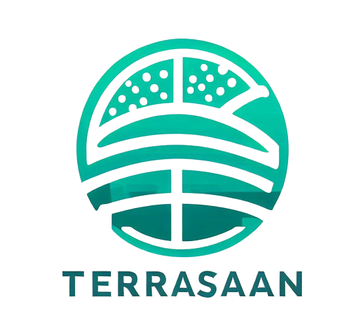

# TerraSaan



TerraSaan is an innovative agricultural tool that utilizes advanced AI and real-time monitoring to detect and manage weed infestations in crop fields. It provides farmers with a user-friendly platform for optimizing resource allocation, making data-driven decisions, and ultimately ensuring healthier and more abundant harvests.

## Table of Contents
- [Features](#features)
- [Installation](#installation)
- [Usage](#usage)
- [Contributing](#contributing)
- [License](#license)

## Features

- **Weed Detection:** TerraSaan employs cutting-edge AI algorithms for precise weed detection, reducing the need for manual inspection.
- **Real-Time Monitoring:** Monitor your fields in real-time, receiving updates and alerts on weed infestations and crop health.
- **Resource Optimization:** Make informed decisions about irrigation, fertilization, and pesticide application, reducing waste and costs.
- **User-Friendly Interface:** TerraSaan's intuitive interface makes it accessible to both experienced and novice farmers.
- **Data Security:** We prioritize the security of your farm's data, ensuring it remains confidential and protected.

Please note that TerraSaan is currently in the prototype stage of development, and we have plans to expand its capabilities in the future.

## Installation

To install TerraSaan, follow these steps:

1. Clone the repository:

   ```bash
   git clone https://github.com/yourusername/terrasaan.git
   ```

2. Install the required dependencies:

   ```bash
   pip install -r requirements.txt
   ```

3. Run TerraSaan:

   ```bash
   python main.py
   ```

## Usage

1. Access the TerraSaan web interface via your browser (default: http://localhost:8000).
2. Sign in with your credentials or create a new account.
3. Follow the on-screen instructions to set up your farm and field details.
4. Start monitoring your fields and utilize TerraSaan's features for weed detection and resource optimization.

## Contributing

We welcome contributions from the community to help improve TerraSaan. If you'd like to contribute, please follow our [contributing guidelines](CONTRIBUTING.md).

## License

TerraSaan is released under the [MIT License](LICENSE).

---

**Note:** TerraSaan is currently a prototype and is actively being developed. We appreciate your interest and feedback. For more information and updates, visit our [website](https://www.yourwebsite.com) or contact us at [contact@yourwebsite.com].
```

Remember to replace the placeholders such as `[yourusername]`, `[yourwebsite.com]`, and the logo image link with your actual information. Additionally, you can customize this `README.md` to include specific instructions or information related to your project's development and deployment.

# Intel_oneapi_hackathon
To run application you need to install visual studio , this is a prototype only !!!
Download weight file from weight.txt file and paste it into application folder 
Install packegs from requirement.txt to create needed enviroment and veriables
There is three implamentation for problem 
1. PythonApplication2.py ----  Scalable and WOW factors implementation for solving problem.
2. app.py -----  Scalable solution with intel vino inference engine.
3. PythonApplication1.py ------ Simple approach with intel onpe api base toolkit.
4. pythonapplication ---- vs export
